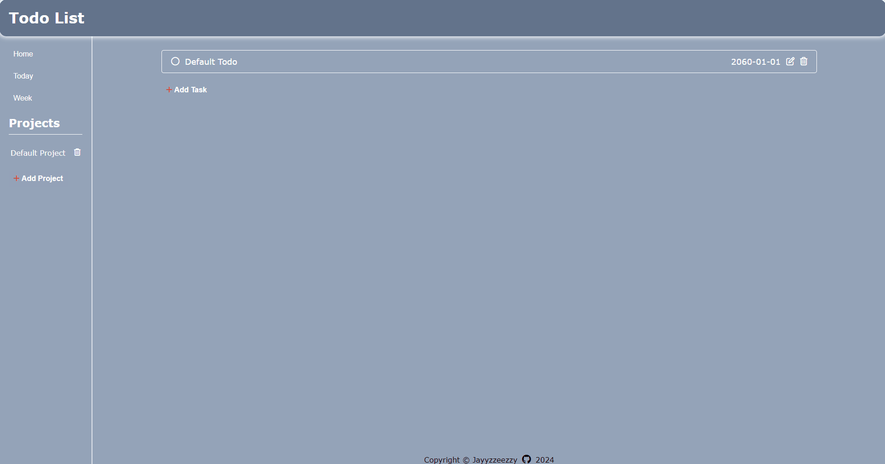

# Todo List

[Live Demo](https://jayyzzeezzy.github.io/todo-list)

## Description

A personal task manager that helps you organize your projects, plan your day, and make meaningful progress towards your goals.  

This is part of [The Odin Project](https://www.theodinproject.com) curriculum.

## Features

- Dynamically create, edit, and delete todo items. 
- Allows you to group todos into a project.
- View all todos in the home page.
- Quickly display todos that are due on the same day/week with a click of a button.
- Any changes made are saved to `localStorage`

## Built With

- HTML
- Vanilla CSS
- Vanilla JS
- Webpack
- NodeJS

## Challenges I faced

When I was starting out on this project, I struggled on narrowing down to the most optimal design pattern. 

I debated between constructors/classes, function factories, and IIFE module patterns. Eventually, I settled on function factories because I wanted more practice in that area. 

Other challenges that I've come across is trying to apply the OOP Principles (i.e. The Single Responsibility Principle and Loosely Coupled Objects), while also trying to write out some code to just have a working application. 

## What I learned

- DOM manipulation: create node, render info into each node, update node, and delete node. 
- Using Web Storage API (i.e. `localStorage`)
- JS design patterns
- OOP Principles

## Improvements I want to make

- JS Organization: refactor function factories with classes/constructors and implement IIFE module patterns. 
- OOP Principles: make more loosely coupled objects to ensure a more modular code overall. 
- Add more features like todo priority and allowing users to write a description. 

## Credits

- JS library: [date-fns](https://date-fns.org)
- Icons: [Font Awesome](https://fontawesome.com)
- UI inspired by [Notion](https://www.notion.so)